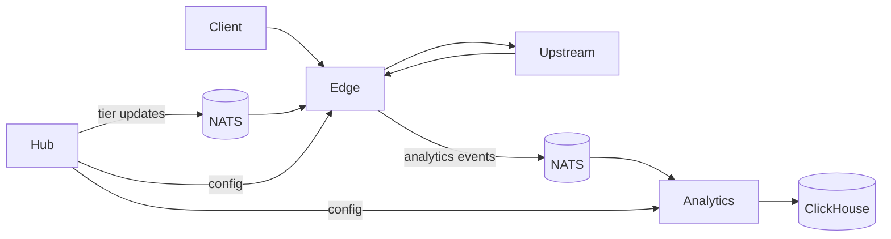

# Gate Architecture

Gate is a distributed API governance platform with three services:

- Edge: data plane for request handling, caching, enforcement, and analytics emission.
- Hub: control plane for configuration, tier assignment, and authoritative quota leasing.
- Analytics: observability plane for ingesting edge events and serving summaries and charts.

## Service Responsibilities

## Edge
- Receives client traffic at paths shaped as /{prefix}/{service}/...
- Applies middleware pipeline (analytics capture, CORS, auth, cache, rate limit, proxy)
- Resolves tier policy via cached data with hub-backed fallback behavior
- Emits analytics entries to NATS, including edge_id

## Hub
- Loads and validates gateway config JSON
- Serves effective control-plane config to edge and analytics
- Handles tier CRUD and rate lease coordination
- Publishes tier updates for edge cache invalidation

## Analytics
- Subscribes to analytics events via NATS
- Persists events in ClickHouse
- Serves summary and series endpoints and static dashboard assets
- Applies filter pushdown and computes trends from current vs previous windows

## Data and Messaging Paths

- Client -> Edge -> Upstream -> Client
- Edge -> NATS analytics subject -> Analytics -> ClickHouse
- Hub -> NATS tier updates subject -> Edge
- Edge/Analytics -> Hub config endpoint for effective policy

## High-Level Topology

## Code Map

- cmd/edge/main.go
- cmd/hub/main.go
- cmd/analytics/main.go
- packages/edge
- packages/hub
- packages/analytics
- packages/common
